# Skyvern UI

A self-hosted web interface for [Skyvern](https://github.com/Skyvern-AI/skyvern) — the open-source AI-powered browser automation platform.

**Skyvern UI adds what Skyvern doesn't ship out of the box:** user authentication, role-based access control, and a secure API proxy — so you can deploy Skyvern in production without exposing it directly to the internet.

## Screenshots

<table>
  <tr>
    <td>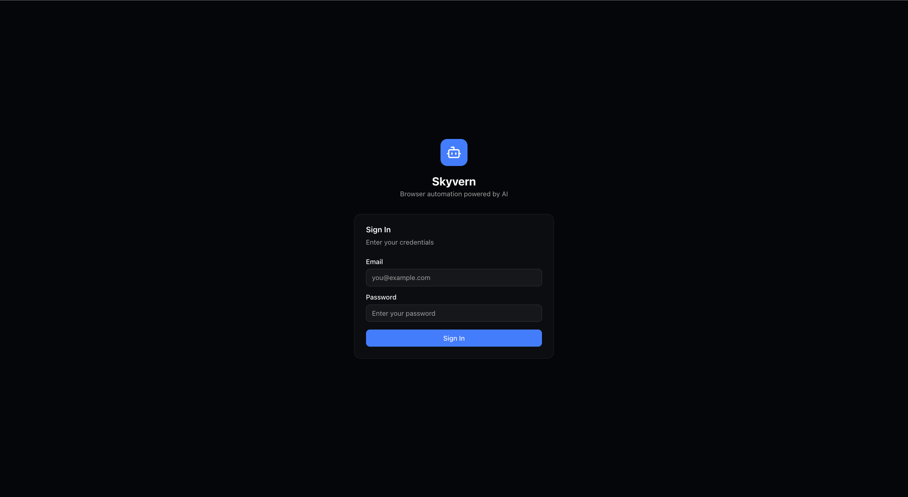<br><b>Login</b></td>
    <td>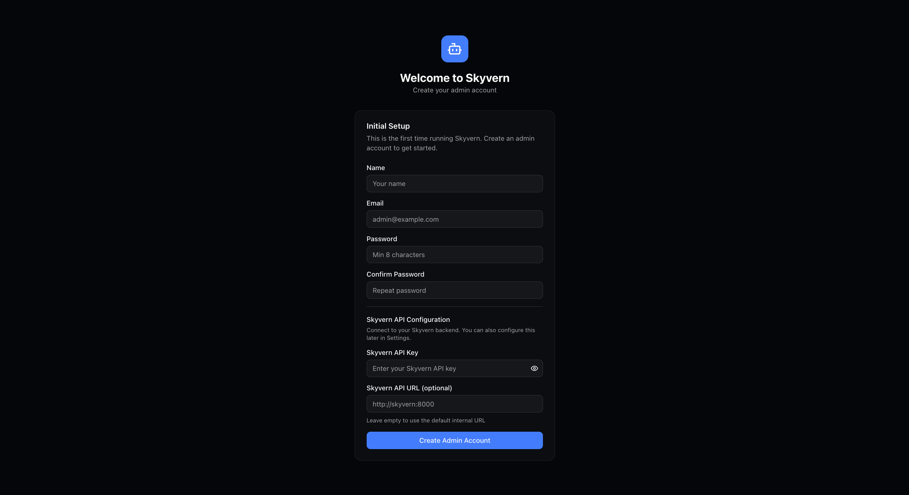<br><b>Setup Wizard</b></td>
  </tr>
  <tr>
    <td>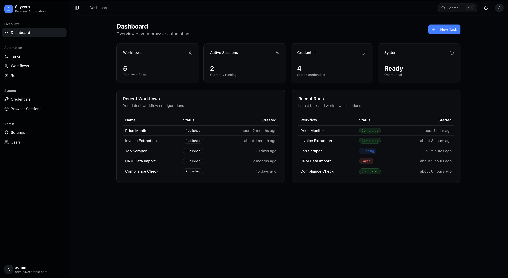<br><b>Dashboard</b></td>
    <td><br><b>Workflows</b></td>
  </tr>
  <tr>
    <td>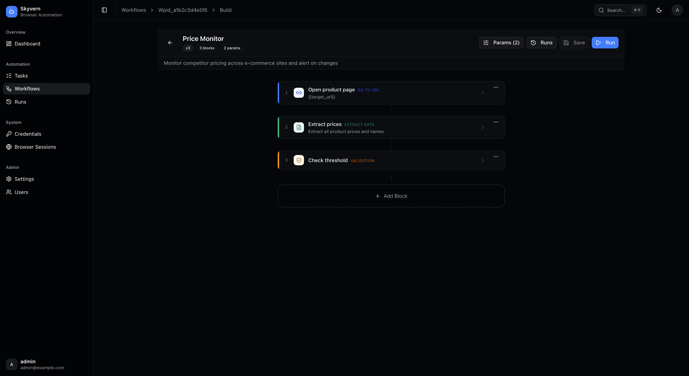<br><b>Workflow Builder</b></td>
    <td>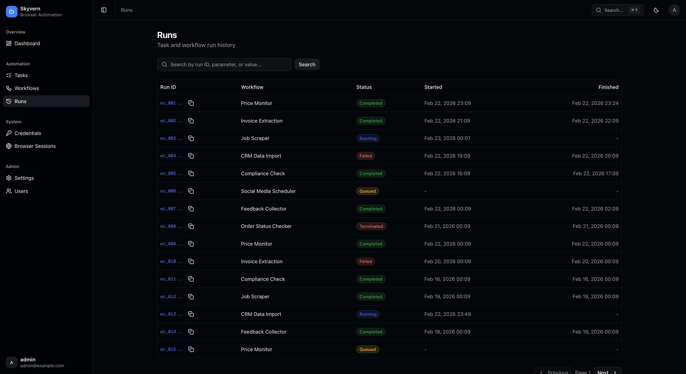<br><b>Runs</b></td>
  </tr>
  <tr>
    <td>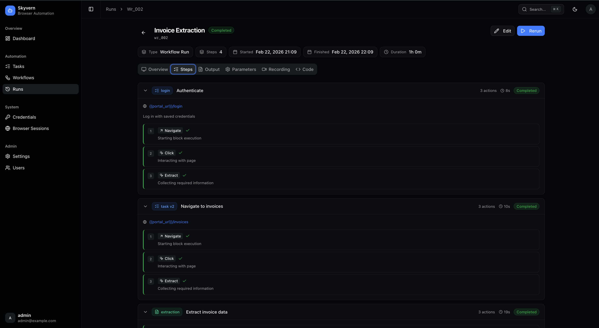<br><b>Run Detail — Steps</b></td>
    <td>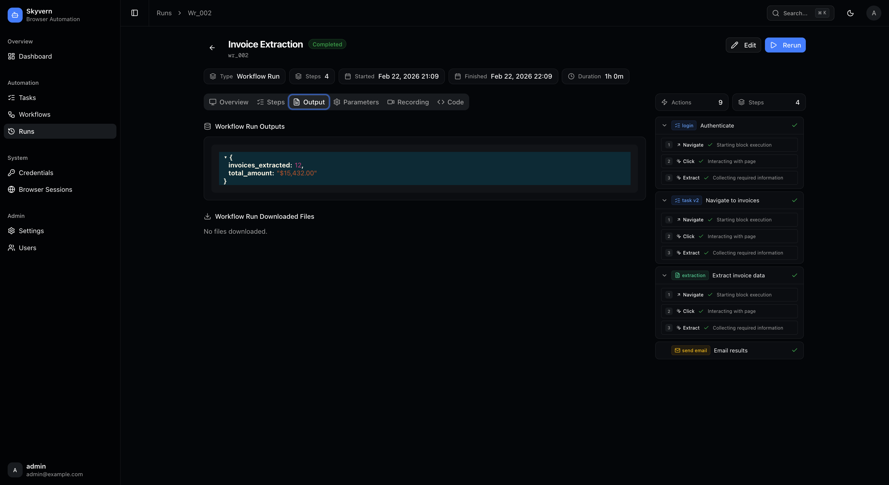<br><b>Run Detail — Output</b></td>
  </tr>
  <tr>
    <td>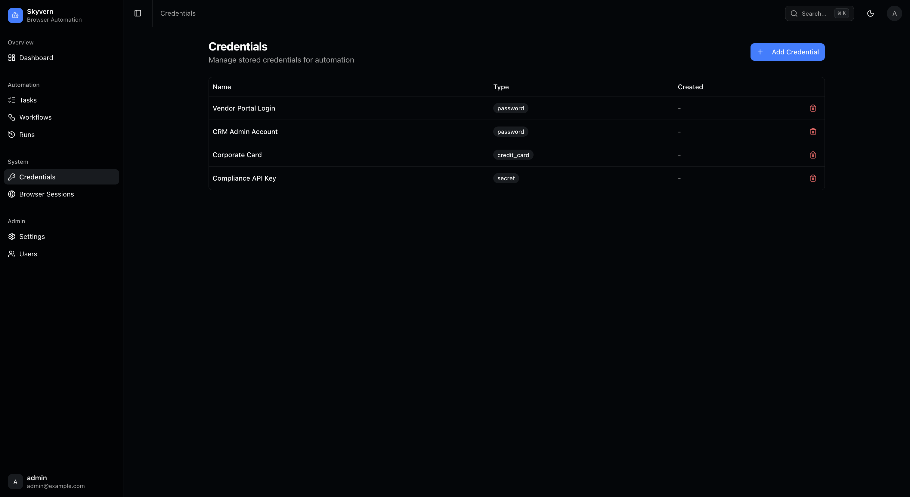<br><b>Credentials</b></td>
    <td>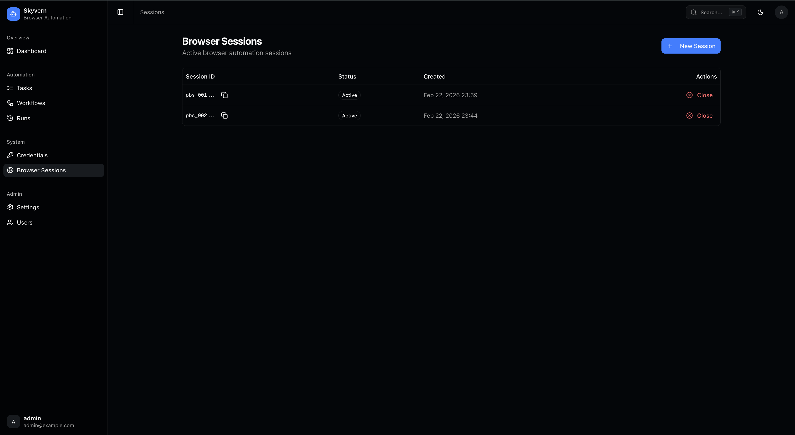<br><b>Browser Sessions</b></td>
  </tr>
  <tr>
    <td>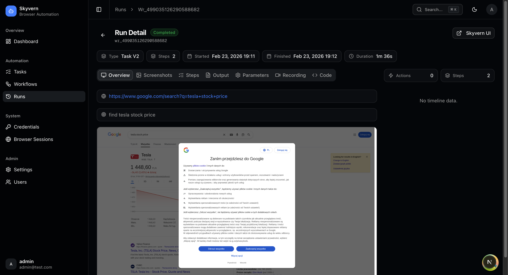<br><b>Run Detail</b></td>
    <td>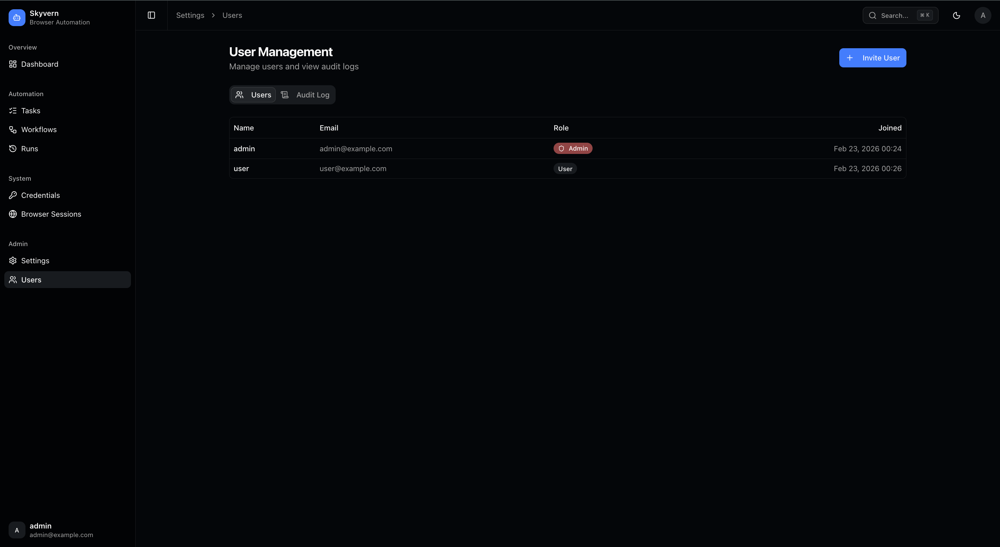<br><b>User Management</b></td>
  </tr>
</table>

## Why does this exist?

Skyvern's built-in frontend has no authentication. Anyone with access to the URL can run automations, view credentials, and access the API key. That's fine for local development, but not for production.

Skyvern UI wraps Skyvern with:

- **Authentication** — email/password login with server-side sessions (30-day expiry)
- **Role-based access** — admin and user roles; admins manage users, regular users run automations
- **Secure API proxy** — the Skyvern API key is stored in the database and injected server-side; it never reaches the browser
- **Initial setup wizard** — the first person to access the app creates the admin account; no public registration
- **Audit logging** — every write operation is logged with user, action, IP address, and timestamp

## Features

- **Tasks** — create and run one-time browser automations
- **Workflow Builder** — block-based editor for multi-step automations with parameters
- **Run History** — browse executions with timeline, output, recording playback, and artifacts
- **Credential Vault** — store passwords, credit cards, and secrets for use in automations
- **Browser Sessions** — create and monitor live browser sessions with real-time viewport
- **Command Palette** — Cmd+K / Ctrl+K for quick navigation
- **Dark Mode** — light and dark theme support
- **User Management** — invite users, assign roles, browse audit logs (admin only)

## Quick Start

```bash
git clone https://github.com/your-username/skyvern-ui.git
cd skyvern-ui
cp .env.example .env.local
# Edit .env.local — set BETTER_AUTH_SECRET (openssl rand -base64 32)
docker compose up -d
```

Open `http://localhost:3000` — the setup wizard will guide you through creating your admin account and configuring the Skyvern connection.

## Tech Stack

Next.js 16 (App Router) / Better Auth / PostgreSQL + Drizzle ORM / shadcn/ui + Tailwind CSS 4 / TanStack Query + Table / React Hook Form + Zod / Zustand / Framer Motion / Sonner / cmdk / Lucide

## Documentation

- [Architecture](docs/architecture.md) — how the proxy, auth, and artifact proxy work
- [Development](docs/development.md) — local setup, available scripts, project structure
- [Deployment](docs/deployment.md) — Docker Compose, environment variables, security checklist

## License

MIT
